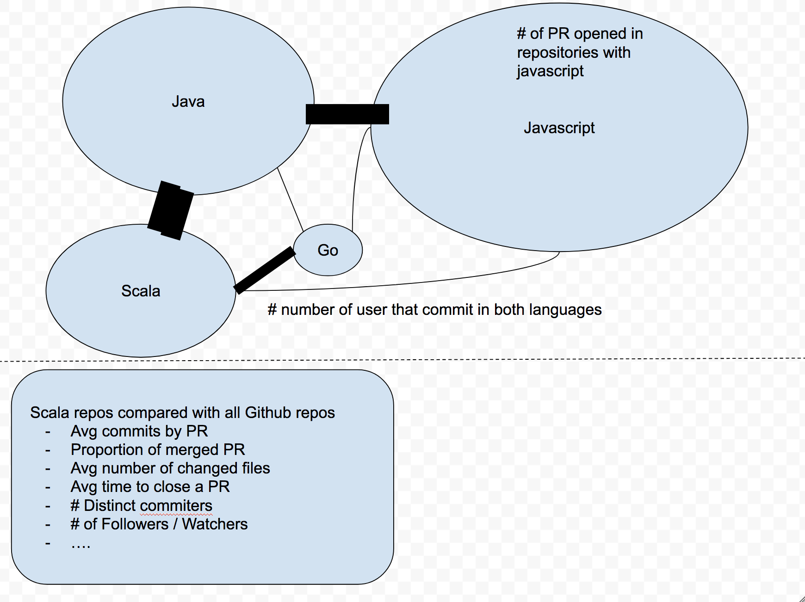

# Data Visualization Project
Project for Data visualization (COM-480) course @ EPFL

## Overview
The goal of this project is to analyze the GitHub users’ behavior, explore relations among overall programming language usage and the overlaps in the different languages that programmers use. We also want to show how this changes over time, taking into account monthly activity from February 2011 to the present day. present day.  

## Motivation
We use GitHub every day but we don’t know how other people use it and what is the behaviour of users that are programming in different languages and the relations between languages themselves. We wondered do programmers use several languages at the same time and do they "migrate" to new languages when they appear.

## Target audience
Our target audience are both GitHub’s users and newcomers to the programming world who would like to have an overview of the general behavior on GitHub over a specific time period.

## Related work and inspiration
Some inspiration for our project can be found on the following links:
 * http://githut.info/ (A Parallel coordinates visualization of most used programming languages on GitHub)
 * http://blog.coderstats.net/github/2013/event-types/ (A Jupyter Notebook with visual overview of GitHub event types from 2013)
 * http://geeksta.net/geeklog/exploring-expressions-emotions-github-commit-messages/ (An exploration of expressions of emotions in commit messages)
 * https://www.youtube.com/watch?v=U_LNo_cSc70 (A video showing the analysis of millions of GitHub commits - "What makes developers happy, angry, and everything in between?")

## What are we trying to show with our viz?
We want to analyze the interaction of users in projects with different programming languages and the number of commits per language and project over time. For instance, do users who contribute to projects in Scala also contribute more to projects in Java or Python?
The users will be able to compare one programming language to another with the possibility to see which one is the “closest” to their preferred language.  Also, our audience will be able to see a statistical analysis of the usage of the specific language. By selecting a language, the users will be able to see:
 * Average number of commits by Pull Request for the specific language
 * Average number of changed files by language by Pull Request/Commit
 * Average number of forks/watchers/followers
 * ...

Possibly show the trends in migrations of programmers from one language to another.

A very broad idea about what we’ll do is in the following image:
<p align="center"></p>

## Where does it come from, what are you processing steps?
The dataset that we will use is the [GitHub Archive](https://www.githubarchive.org/). GitHub Archive is a project with the aim to record the public GitHub timeline, archive it, and make it easily accessible for further analysis. The data is available from 12. February 2011. with events aggregated into hourly .json archives. It can be downloaded directly via HTTP or accessed with Google BigQuery.

The documentation for the different types of events that are recored in the archive is available on this [link](https://developer.github.com/v3/activity/events/types/).

We might use the information from [Google Trends](https://trends.google.com/trends/) and [TIOBE Index](https://www.tiobe.com/tiobe-index/) to analyze the language’s popularity over time, but this is a topic to discuss yet.

## Processing steps:
 1) Filter the database for `PullRequestEvent` entries.
 2) Remove entries that have a NULL value for the programming language feature (seems to be a small percentage for pull request)
 3) Analyze this data to reveal the parameters specified above (number of commits by language, file changes by language, number of forks, time between open and close, ...)
 
 
## How to run the application
In order to run this project you must have `npm` installed in your machine. Then run:
```bash
npm install
npm start
```
The last command should spin a new browser tab in http://localhost:8080.


## How to get and process the data
To download the data, processing and save you must have installed `python3` in your machine and run:
```bash
bash grab_data/get-data.sh
```